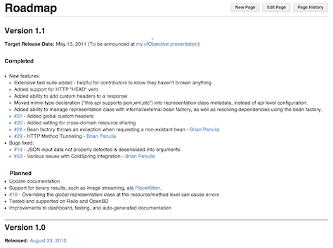

I've told a few people recently that I would like to have [Taffy](https://github.com/atuttle/Taffy) 1.1 officially released at or before cfObjective, but I figured it was time to firm up some specific goals and put a date on it. To that end, I've put up a [Roadmap](https://github.com/atuttle/Taffy/wiki/Roadmap) with my target release date, and a list of completed and planned changes.

I heard from someone yesterday whose company is hesitant to use the bleeding edge release, and is still using the 1.0 release. Not that it was a bad build, but a lot has changed for the better, so I'm eager to get 1.1 done and released for people like these.

Here's hoping this plan comes together.
