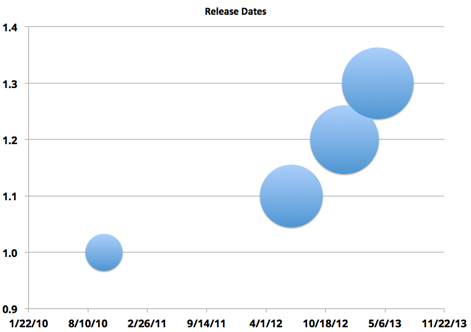

Today I'm happy to officially release version 1.3 of Taffy, continuing my quest to keep to a greatly-reduced release cycle:

I don't want to release so often it's annoying to have to upgrade, but still often enough to get bug fixes and new features out. How does 2 releases a year sound?

<a href="https://github.com/atuttle/Taffy/archive/v1.3.0.zip" class="btn btn-success">Download Taffy 1.3.0 stable</a>

Here are the release notes for **Taffy 1.3.0**:

* Meta / Project Management Changes
  * From this point forward, the `master` branch will be used for day-to-day development, not just merging in stable releases. Stable releases will still be available for download via [the tags page](https://github.com/atuttle/Taffy/tags). Should any maintenance releases be necessary, they'll be done in branches created from the applicable release tag.
  * We've had an extensive test suite for a while now, but I've finally setup a Jenkins instance and am doing a bit of continuous integration. You can see the build stats here:  and this badge has been added to the [ReadMe](https://github.com/atuttle/Taffy#readme).
* Bugs Fixed:
  * [#105](https://github.com/atuttle/Taffy/issues/105) - Static URIs that would match dynamic URIs are now allowed (`/user/logout` would previously conflict with `/user/{userId}`). Pay special attention to [URI Matching Order](https://github.com/atuttle/Taffy/wiki/Configuration-via-Metadata#uri-matching-order).
  * [#120](https://github.com/atuttle/Taffy/issues/120) - Added support for `*/*` Accept header value. _Thanks to Brian Quackenbush_ for the patch!
  * [#124](https://github.com/atuttle/Taffy/issues/124) - Fixed a Railo-specific bug blocking resources from being loaded when the resources folder isn't in the web root. _Thanks to Jean-Bernard van Zuylen for the initial bug report and the [pull request!](https://github.com/atuttle/Taffy/pull/133)_
  * [#129](https://github.com/atuttle/Taffy/issues/129) - Fixed a bug that MANY people have asked about recently: when you don't supply _any_ form of requested return format (via header or URL "extension"), the dreaded "your default mime type is not implemented" error was returned. Jean-Bernard van Zuylen provided an [epic detailed bug report](https://github.com/atuttle/Taffy/issues/129), as well as [the pull request that ultimately fixed it](https://github.com/atuttle/Taffy/pull/132). A regular open source hero!
  * [#130](https://github.com/atuttle/Taffy/issues/130) - Fixed a regression in changes to the dashboard to use the new endpoint url param. _This one was also reported and fixed via pull request by Jean-Bernard van Zuylen._
* New Features:
  * Added a new [queryToArray](https://github.com/atuttle/Taffy/wiki/Index-of-API-Methods#querytoarrayquery-data) helper method for transforming query objects into an array of structures, preserving column name case.
  * [#91](https://github.com/atuttle/Taffy/issues/91) - A [message](https://www.evernote.com/shard/s240/sh/6b166322-d8a8-4209-8de1-7348abd8baca/3b4072548cd291ded70ae60f1d4d5583/deep/0/Taffy%20messaging%20when%20no%20resources%20are%20defined.jpg) is now displayed if Taffy can't find any resources.
  * [#99](https://github.com/atuttle/Taffy/issues/99) - Show dashboard without the `?dashboard` query param (just browse to the root of your API). See deprecations, below.
  * [#102](https://github.com/atuttle/Taffy/issues/102) - Added support for DI/1 bean factory. See [this example](https://github.com/atuttle/Taffy/blob/1.3-dev/examples/api_DI1/Application.cfc) for a sample implementation.
  * [#103](https://github.com/atuttle/Taffy/issues/103) - Added [environment-based configuration](https://github.com/atuttle/Taffy/wiki/Environment-Specific-Configuration).
  * [#108](https://github.com/atuttle/Taffy/issues/108) - Added helper method `getBasicAuthCredentials()` to api.cfc (so you can [use it in your Application.cfc](https://github.com/atuttle/Taffy/wiki/Authentication-and-Security)). It returns a structure with keys `username` and `password`, and if _NO_ basic auth credentials have been included in the request then both values will be blank.
  * [#109](https://github.com/atuttle/Taffy/issues/109) - Added helper method `saveLog()` to resource classes, which delegates to your [configured exception logger](https://github.com/atuttle/Taffy/wiki/Exception-Logging-Adapters). You may now use: `saveLog(cfcatch)` from inside a resource.
  * [#115](https://github.com/atuttle/Taffy/issues/115) - You can now [use properties instead of setters](https://github.com/atuttle/Taffy/wiki/So-you-want-to:-Use-Taffy's-built-in-Dependency-Injection-to-resolve-dependencies-of-your-resources) to have Taffy autowire dependencies. (Setters are not deprecated; this is just an additional option.)
  * [#117](https://github.com/atuttle/Taffy/pull/117) - Added support for [endpointURLParam](https://github.com/atuttle/Taffy/wiki/List-of-all-variables.framework-settings). _Thanks [Marco Betschart](https://github.com/marbetschar)_.
  * [#122](https://github.com/atuttle/Taffy/issues/122) - Added support for [ETag based caching](https://github.com/atuttle/Taffy/wiki/List-of-all-variables.framework-settings)
  * [#128](https://github.com/atuttle/Taffy/issues/128) - Now support **Access-Control-Allow-Headers** to list allowable headers for Cross-Domain requests. _Thanks to [Marco Betschart](https://github.com/marbetschar) for the bug report and the patch!_
* Deprecations:
  * Using `?dashboard` to display the dashboard is now deprecated in favor of simply browsing to the root of your API, with or without /index.cfm in the url. E.g. `http://api.acme.com/` or `http://api.acme.com/index.cfm` instead of the old `http://api.acme.com/?dashboard`

As always, the full changelog history is available on the [Release History](https://github.com/atuttle/Taffy/wiki/Releases) page of the wiki.
