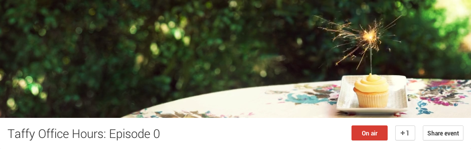

As suggested and discussed in the comments of my post [How Should we Celebrate Taffy's 3rd Birthday?](/blog/2013/How-Should-we-Celebrate-Taffy-s-3rd-Birthday/) I'm going to try something new and interesting.

Starting on August 23rd (just a few days away), I'll be holding monthly "Office Hours" for Taffy. It will be an opportunity for you to come and ask about a Taffy-related problem you're having or an idea you want feedback on, as well as an opportunity for me to interact with the Taffy community together, instead of one-off via email. It sounds like a lot of fun, to me!

If it's well received and a good use of all of our time, then I can see it becoming a monthly thing - even sort of a video podcast, for those that can't make it in real time. I'm thinking Fourth Fridays; which aligns well with the 3rd birthday approaching, and who doesn't like to set aside an extra hour for pseudo-work on Fridays?

### Logistics

**When:** Friday, August 23rd [from 11:00am to 12:00pm US-Eastern](http://everytimezone.com/#2013-8-13,180,6bj) 
**Where:** [A Google+ Hangout](https://plus.google.com/events/cnfb0d2tpl0f5u2ujivoab45n6s), for the first 10 to arrive - to be streamed live on YouTube for anyone beyond the 10 person hangout limit.

Want to submit your question/topic in advance? [Here's a form to do just that!](https://docs.google.com/a/fusiongrokker.com/forms/d/1Q-qvulvkH5YikUQvlzejulqltRGXmMaxgA5DC6wJj4M/viewform)

In addition to the advance topic submission form, I'll also make sure I'm in the IRC chat room **#taffy on freenode** so that we can have live interaction with anyone watching the youtube stream.
