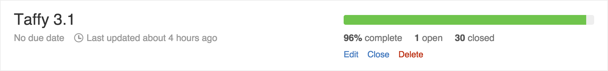
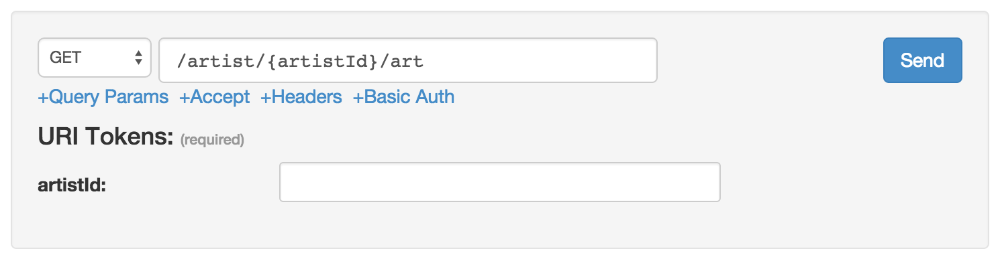

Yep, you read that right! It's time to start testing [Taffy 3.1.0-RC1](https://github.com/atuttle/Taffy/archive/v3.1.0-RC1.zip) in your environments. I've been using the bleeding-edge code in production for months now without issue. All that was holding up the release was a few minor tickets and some documentation that needed to be written, and over the weekend (and some early this morning) I [knocked almost all of that out](https://github.com/atuttle/Taffy/milestones).

The only remaining ticket is to [find a good place to document the X-HTTP-METHOD-OVERRIDE header](https://github.com/atuttle/Taffy/issues/270). (Any ideas?)

As you can read for yourself in the [Release Notes](http://docs.taffy.io/3.1.0/#What-s-new-in-3-1-0), this release includes 11 bug fixes and 13 enhancements. The most noticeable changes all center around the dashboard. In particular, one that's been bugging me for a long time: It was getting too cluttered with stuff that you probably didn't need for a majority of your API's / requests. Now all of those extra non-essential features are hidden and easily toggled from a set of links:

Please [Download Taffy 3.1.0-RC1](https://github.com/atuttle/Taffy/archive/v3.1.0-RC1.zip) and give it a shot with your API. If you have any issues, please [file a ticket](https://github.com/atuttle/Taffy/issues) or we can talk about it in the **#taffy** channel on the [CFML slack](http://cfml-slack.herokuapp.com/) team.
