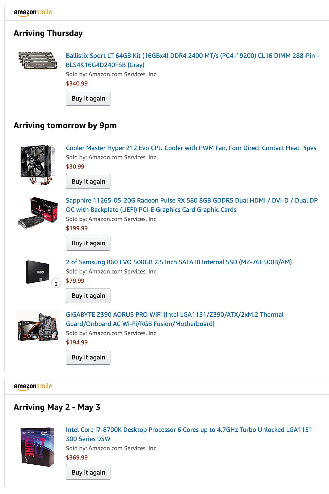
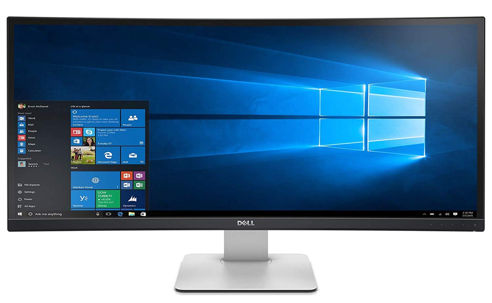

Well... I just spent a bunch of money, so... _endorphins!_

My current work computer is a **Mid 2014 Macbook Pro with a 2.2GHz i7 processor and 16gb of RAM**, and it's been in a long, slow, painful tailspin toward death for months now. I'm actually kind of surprised that it's still alive. I get tons of video artifacts at random intervals. At times certain apps or the whole machine will lock up and I have no choice but to sit and wait for it to catch up. It regularly gets so hot that the glue holding the rubber feet has basically disintegrated, and two of the feet have come off. I keep them on my desk... you know, in case I ever decide to try to reattach them? I know that I never will, but those things are part of _my precious_ so what do you want me to do? Throw them away?!

It's high time that I stop waiting for this thing to die and start getting proactive. But here's the thing... I'm comfortable, but I'm not made of money.

- It costs about $3,000 for a base-spec Mac Pro: **6 core 3.5GHz, dual gpu, 16gb memory** -- So not that much of an upgrade over my current Macbook Pro!
- Or $1,100 for a base-spec iMac: **dual core 2.3GHz, 8gb memory** -- So a literal downgrade from my dying Macbook Pro!
- So spending about $1,300 on parts to build a machine capable of eating either of those two options for breakfast is kind of a no-brainer.

But I just can't give up OSX. I did an experiment about a month ago where I tried running Ubuntu as my desktop OS on a spare computer and it did not go well. The development experience was acceptable (more or less the same as *nix tools on OSX). But a Chrome update broke Chrome one day, and I don't recall if it was that problem or another one that ended with me re-installing the OS; but the first half of this sentence should give you a pretty clear picture of my experience running Linux as my desktop OS. It was far too fragile for me.

You will have a really hard time as a web developer if you can't use your web browsers.

**I need stability.** And I have something like 10+ years experience using OSX as my daily-driver. It's mostly like Windows, with a lot more polish, and dev tools that work well together and don't feel like they were an afterthought (see: PowerShell) or bolted on (see: Windows Subsystem Linux). The core experience of being a developer on OSX has spoiled me.

But Apple hardware? H\*ck. I can't afford that stuff!

So Hackintosh here I come. Here's a rundown of what I bought:

- [Gigabyte Z390 AORUS PRO WiFi][mobo] motherboard
- [Intel Core i7 8700k][cpu] (6 cores, 4.7GHz)
- [64gb (4x16gb) memory][mem] DDR4 2400 MT/s (PC4-19200)
- [Radeon RX580][gfx] graphics card
- [Cooler Master Hyper 212 Evo][cooler] CPU Cooler
- A pair of [Samsung 860 EVO 500GB SSDs][ssds] to act as boot drives (more on this in a future post)

... And I've barely spent more than a base model iMac. I could throw in a [Dell curved 34" 21:9 monitor][monitor] and _still_ spend less than I would need to configure an iMac for my purposes.

For what it's worth, I'll also be using an ATX case, 550 watt power supply, and some 2tb hard drives, all of which I already had on hand.

To be honest, I'm a little terrified that I'm dropping a huge pile of cash on a gamble that I can pull off a functioning Hackintosh. I've wanted to do this for years and years but never done it before, and the idea of failing with such a high price tag is scary. So yeah, I'm a lotta terrified. But lots of people have been doing this for a long time, and it's getting easier all the time, right?

So let's do this... I'll do my best to chronicle my experience here, so stay tuned!

And who knows... If this works out well, maybe I'll treat myself to a victory monitor...

[mobo]: https://amzn.to/2GTr3JX
[cpu]: https://amzn.to/2PG0jiO
[mem]: https://amzn.to/2LelnOS
[gfx]: https://amzn.to/2LbLbLt
[cooler]: https://amzn.to/2LbKEZZ
[ssds]: https://amzn.to/2Wg5xEH
[monitor]: https://amzn.to/2US6VvE
