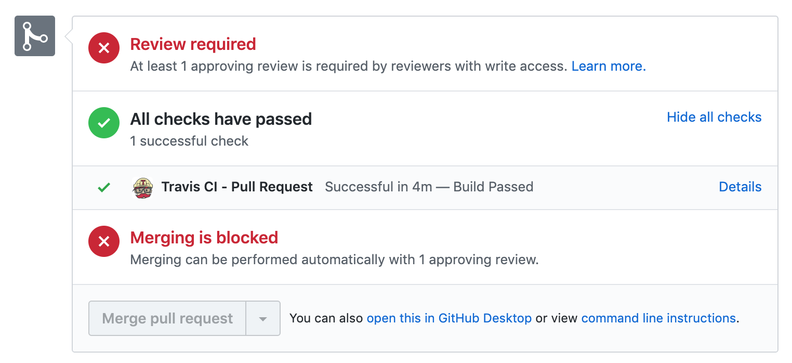

import { TwitterTweetEmbed } from 'react-twitter-embed';

> The title of this post is a callback to a blog post I read seven and a half years ago. I really wish I still had or could find the link, because I would love to link it. It was based on a quote attributed to Hannibal, which went something like, "We will find a way, or we will make one." I've probably butchered it, because it was more than seven years ago, and because I can't find it. I'm sorry. Please [hit me up](https://twitter.com/adamtuttle) if you can find it!
>
> It was a blog post and open letter from a startup founder to his early-stage employees; and it was about empowering them to do what they needed to do to accomplish their mission. They all had the company credit card and the authority to use it (responsibly) to push them toward success. Hence, "Find a way, or make one."
>
> It was my then-soon-to-be business partner Steve that sent me the link. I got it in an email from him on my way to a conference. He sent it while I was on my flight, and I remember sitting in a packed SuperShuttle on a hot day next to a couple of sweaty dudes, sun blaring in the window, rapt, reading it on the way to the conference hotel. _It made that kind of impression on me._ We had recently decided that I would quit my corporate job and come work with him, and that we wanted to create a product that would eventually become [AlumnIQ](https://www.alumniq.com).

It's been seven years and change since we started that adventure. AlumnIQ now has five full time employees, 10 customers for our primary product and dozens for our ~~gateway drug~~ secondary and tertiary products. We have _a lot_ of code and, it probably won't shock you to learn, a lot of technical debt too.

All along the way we've [chosen boring technology](http://boringtechnology.club/) to allow us to spend our mental energy on solving hard problems. We intentionally avoided premature optimizations and built things with tech and strategies that we knew would eventually need to be replaced, because what we didn't know was how soon they would need to be replaced. This turned out to be just what we needed. We amassed a healthy pile of technical debt in service of getting our product into the hands of our customers and getting profitable.

And then we became successful. More successful than we were ready for, faster than we expected, and before we knew it was happening that healthy technical debt we intentionally accepted early on took an unplanned turn toward unhealthy. Things started to feel more like a maxed-out credit card where most of your monthly payment goes toward interest.

Here's where we made a mistake: Like every dev shop I've ever worked for in the past, we don't have nearly enough automated tests. **(Wait... Am I the problem?!)** And if my experiences, and discussions at conferences are indicative of anything, that's also true for most businesses. We do test things, but most of that is done manually. You know what manual testing is terrible for? Finding regressions. When fixing one thing breaks something else.

The frustrations we're experiencing with 5 employees and 10 customers are only going to get worse as we continue grow. And for... _reasons_... I am certain that those frustrations are not going to grow linearly. Probably more like exponentially. We need to get our testing situation improved, and fast.

Fortunately, automated testing is a pretty well understood problem space, right?!

Well, one of those _boring tech choices_ we made was to use the coding language CFML, because Steve and I were both well versed in it and able to be productive on day 1. And CFML is _fine_ (not a discussion I'm interested in right now!) but it certainly doesn't have much mind-share in 2019. There aren't many people working on (open source projects for the good of the community in) the frontier of good ideas, and a lot of things get left to wither on the vine a bit while their creators are off carrying the torch in other interesting problem spaces.

Case in point: Continuous integration tech for CFML is possible, but frustrating to figure out and options are limited. How do I know? I just spent two days sorting through it all.

<TwitterTweetEmbed tweetId={`1178068571005558786`} options={{hideThread: true, hieCard: true, cards: 'hidden'}} />

As I mentioned in my tweet, I've figured it out. But it wasn't easy and it ultimately only worked after a dozen failed attempts, and only once I put together several puzzle pieces of more recent tech in the CFML world. So with huge thanks to the community around TestBox and CommandBox, I'm happy to share my proof of concept repo for running CFML continuous integration tests on Travis-CI.

Here's the repo: [CFML-CI-2019](https://github.com/AlumnIQ/CFML-CI-2019). It's based heavily on Matt Gifford's similar repo [cfml-ci](https://github.com/coldfumonkeh/cfml-ci), but here are the problems that I ran into and how I solved them:

- Matt's repo was last updated in November of 2016. Circle CI has released a v2 of their service, and it doesn't seem like they still support their v1 configs, which is what Matt was using. V2 is based heavily on Docker which, especially when used in combination with CFML engines, is not my strong suit. I ripped out all pretense of Circle CI support/examples. While I was at it, I also ripped out MXUnit support because (1) it's 2019, and (2) I didn't have any MXUnit tests to run. It would be trivial to add that back in if you need it, though. (See cfml-ci.)
- Matt's Travis CI support was built around Ant and manually installing the CFML server. Since cfml-ci hasn't seen updates recently, the CFML server versions that are important to me aren't already included. I started looking around for other CFML projects that I knew used Travis and remembered that FW/1 does, so I peeped [their config](https://github.com/framework-one/fw1/blob/1c946217c1aae1a58e8569b366905f8b08d68c46/.travis.yml). I was excited to see that it uses CommandBox both for installing the server and for running the tests. Fortunately this is a space I had been wading into over the last few weeks anyway, so it was a happy coincidence. Ultimately this realization is what put me on the path to success.
- Lastly, I found [this page in the TestBox docs](https://testbox.ortusbooks.com/continuous-integration/travis) describing how to get running on Travis. Cribbing from those various sources, as well as troubleshooting on the CFML Slack (a fantastic resource!), I was able to get my proof of concept running: 

I've been able to take this proof of concept and adapt it to our main product repo, and now we're getting test results right in our pull requests!

I'm not promising to keep this repo up to date as Travis, TestBox, and CommandBox evolve, but it should at a minimum serve as a useful snapshot of what's required to run CFML TestBox tests on Travis in late 2019. I'd be willing to port my changes into cfml-ci, and I have reached out ([sort of](https://github.com/coldfumonkeh/cfml-ci/issues/10#issuecomment-536204823)) to see if there's interest in that... Likewise, if anyone wants to contribute to my repo, that's welcome too.

What does this have to do with "Finding a way, or making one"? Our tech debt has been causing burnout around the team, and making it recur much more rapidly, too. Some days I would struggle to overcome my sense of dread at how bad things can get when you don't stop to take stock often enough. Solving this testing problem was my way of pushing through the pain and making a way to enjoy my work again.

I realized that we have an elephant in front of us and a mandate to eat it. And there's only one way to do that: One bite at a time.

Make one small improvement that measurably moves you closer to your goal. Then figure out what comes next, and make one more small improvement. Repeat that enough times, and pretty soon the elephant disappears.

That's the theory, anyway.
