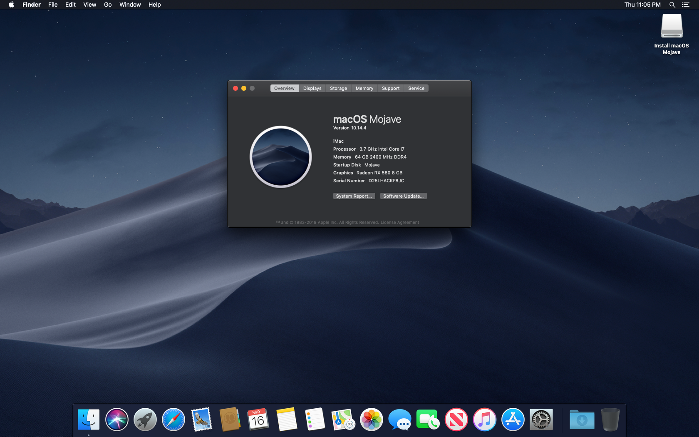

> This is part two in an ongoing series where I document my experiences building my first Hackintosh.
> - [Part one: My motivations, and hardware I purchased](/blog/2019/building-a-hackintosh-2019/)
> - Part two: you are here
> - [Part three: Almost a year later](/blog/2020/hackintosh-iii-daily-driver/)

Were you a follower of Joel Spolsky in 2005? Did you follow the [Project Aardvark blog](https://www.projectaardvark.com/index.html), where Fog Creek Software hired a couple of interns to build a product over the summer and document the process? That product went on to become [Copilot](https://www.copilot.com/), a service for providing remote computer-support.

The reason I bring it up is because one of the first few technical posts that went up on their blog -- just 16 days after the blog launched -- was titled, "Reflector: Feature Complete" and I think of it often. The point of the post was that the "feature complete" milestone is just the first of many in the life of a big project.

I've reached that first milestone in my Hackintosh!

Of course, there is much yet to do. To give just one example, networking doesn't work yet. There's a whole section of the primary guide that I'm following that is dedicated to required post-install actions, and it might actually be longer than the bios-config and installation part.

So what roadblocks did I have to overcome to get this far? There were a few!

Firstly, the expectation is that you'll use a USB2 (not 3!) thumb drive as your boot/install media, and I didn't have one large enough (16gb) on hand. The only thumb drive I had available >=16gb is USB3. No worries, right? If you plug it into a USB2 port, it should act like a USB2 drive. Maybe? 🤷🏻‍♂️

It's also recommended that you plug that thumb drive into a USB2 port, if you have any more modern options to choose from. Unfortunately, for whatever reason, none of the USB2 ports on my motherboard would work to boot from the thumb drive... which left me with only USB3 and 3.1 ports to choose from. Fortunately, it seemed like it was working fine (booting the installer) despite using a USB3 thumb drive in a USB3.1 port. 🤷🏻‍♂️

I have a feeling this entire series of posts is going to make heavy use of the shrug emoji.

It's been more than a few days at this point, so I hope I get this right: What happened next was that the thumb drive would boot initially, but the installer wouldn't start because it couldn't "see" the thumb drive (that is my understanding based on many searches and much reading of the Tonymacx86 forums). In lieu of a helpful error message, I got [a large icon of a circle with a line through it](https://fontawesome.com/icons/ban?style=solid). As it turns out, this was because it couldn't locate the thumb drive, probably because of the USB3 stuff.

I confirmed this by adding a couple of options to the installer from the bootloader screen. When you get to the clover bootloader screen, use the arrow keys to select your thumb drive to boot, and then hit the space bar to open a menu where you can set some boot flags. If you turn on **verbose mode** and **don't reboot on kernel panic** and you should see an error about not being able to find the root device when the "prohibited" icon is displayed, that indicates inability to find the USB thumb drive to continue booting the installer.

Somewhere on the Tonymacx86 forums I saw some advice to try using a USB2 hub to downgrade the thumb drive in this situation. I didn't have a USB2 hub handy, but I did have a USB 1.1 extension cable, so I gave that a shot and it worked. 🎉

With the GUI installer now loading, my next task was to prepare (partition, format) the hard drive for the OS to be installed onto. The directions don't explicitly say that [you should choose the Scheme "GUID Partition Map"](https://www.tonymacx86.com/attachments/screen-shot-2016-09-12-at-9-37-44-am-png.210182/) (they only mention the Format selection), but that is what's expected and it should be the default. I believe I had found that detail in someone's re-telling of their build on the forum. I ended up switching the Scheme to APFS (more on this later), but I'm not certain it ended up making a difference.

Then things got weird/discouraging.

The installer ran, which is great. Somewhere around "about 2 minutes remaining" the machine rebooted, and I didn't think much of it at the time -- OS installers reboot themselves all the time, right? After the reboot, I saw that the bootloader now showed an option to boot from the SSD and install OSX. That seemed like the obvious next step, so that's what I did. This time it booted into a GUI install and immediately jumped into doing work, with a label of "about 15 minutes remaining." After only a minute or so, it would reboot again. That didn't seem right! (If only I had known...)

Obviously (or so I thought), something was wrong. So I tried again with the verbose/no-reboot-on-panic options selected for the SSD installer boot. Kernel panic! Ugh.

Thinking maybe my USB3 config was still to blame, I decided it was time to bite the bullet and drive to the store (ugh!) and spend a few bucks on a 16gb USB2 thumb drive. Sadly, no improvement.

In desperation, I started searching the forums, and was only able to find one suggestion that seemed worth trying: Switching from GUID Partition Map to APFS. This didn't help anything either. 🤷🏻‍♂️

It was at this point that I realized I have a very limited and (relatively) infrequent opportunity to troubleshoot this further. I have two kids between 8-10 and it's the time of year where they have lots of school activities and extracurricular things going on. And we weren't going to skip an episode of Game of Thrones... so I probably had 2-3 nights per week, after 9pm, that I could work on it. I figured making a post on the forums and only checking on it a couple of times per week would be bad form, so I decided to put it off until I had more time to focus on it. And there it sat, for about a week.

_**If only I had known!**_

Even though I had to be away from my home office from Friday morning through _late_ Saturday night, I decided I was getting desperate enough to post anyway. On Thursday evening [I posted on the forum](https://www.tonymacx86.com/threads/need-help-with-10-14-macpro-ish-configuration-total-noob.277365/) explaining what I had been through so far and asking for help. A few minutes later I went to bed. I checked my email on my phone one last time before turning in for the night, and sure enough someone had replied and explained that the kernel panics were expected and what to do next. Well, there was no going to sleep then!

I returned to my office and got back to work. As it turns out, a couple of (apparent) kernel panics are expected in recent versions of OSX during this process. The advice is to let it restart, continue to choose to boot from the SSD, and let the installer run. I was told it should happen "at least" 3 times. 🤷🏻‍♂️

Lo and behold, the installer completed and I can now boot into OSX!

I've now reached the section of [The Guide](https://www.tonymacx86.com/threads/unibeast-install-macos-mojave-on-any-supported-intel-based-pc.259381/) with the heading "STEP 5: Post Installation with MultiBeast" and that's where I'll pick up on Sunday morning!
