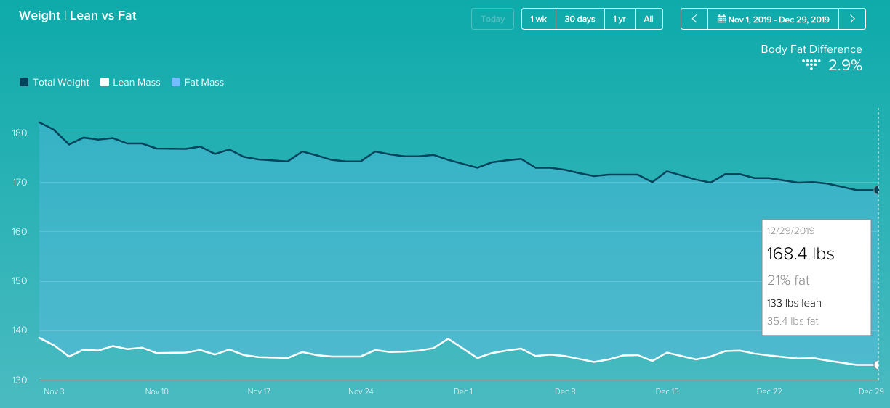

I don't make resolutions, I make goals.

A popular approach to setting goals is to **make them SMART &mdash; that is: Specific, Measurable, Attainable, Realistic, and Timely.** I don't recall where I first heard of this acronym, but what really made it stick for me was becoming a skydiving coach. We're taught to give our students SMART goals because (let's use the short version here)... they work!

## What makes goals SMART?

I'll use my first goal to illustrate: I want to reduce my body fat percentage (BF%) from 21% to 15% and increase my strength by an appreciable amount by the end of 2020.

I don't want to "lose weight," I want to lose a certain amount of weight. And actually, part of this goal is to increase muscle mass, and muscle weighs more than fat. Really, I want to lose BF% not weight. If my body fat goes down but my weight goes up, that would actually make me super happy because it means I put on a bunch of muscle mass! I own a scale that uses electrical resistance to tell me my body fat percentage in addition to my weight, so that takes care of specific and measurable.

I'm not setting a specific strength goal (e.g. bench press 200 lbs) because my goal isn't to get yoked, it's to know that I'm taking care of myself because I can empirically say I'm getting stronger.

Let's get serious here: What I most want is my 20-year-old physique back! I want those lines where my abs meet my hips. Is that attainable and realistic in a year? Definitely not.

So what's attainable? A reduction of a few % points for the year sounds reasonable. I'm about 168.4 lbs and 21% BF right now, which means I'm carrying 35.4 lbs of fat around (_sounds gross when you put it that way!_). Assuming I maintained a weight of 168 lbs, 15% BF would be 25.2 lbs of fat. That would mean I'd replaced almost 10 lbs of fat with muscle. It sounds daunting, but we're talking about an entire year here. I'm going to call that attainable and realistic for me.

Timely is the easy part: Hit it by midnight on 12/31/2020. I'm also going to set milestone goals for every other month.

To jumpstart the process, I've been eating Keto (with the enthusiastic support of my doctor!) and following the workout advice of online personal training service [DevLifts](https://devlifts.io/), since November 1st. I started at 25% body fat and 182.1 lbs and I'm down to 21% and 168.4 lbs already. I'm sure that includes the low hanging fruit like water weight, so that's why my BF% goal for 2020 isn't as aggressive. Thanks in part to a few cheat meals and missed gym days around the holidays, I seem to have plateaued a little bit, but I'm confident that I can get back on the wagon.

To summarize: goal #1 is to reduce my body fat percentage from 21% to 15% and increase my strength (by logging all weights and reps and seeing an appreciable improvement) by the end of 2020.

## What am I doing to help myself be successful?

Here's a tip I've found really useful for my personality: Habit tracking apps. But you have to find the right one for you. I've tried a few over the years that gamified accomplishing your goals (like Habit RPG), but found that the juice wasn't worth the squeeze and I eventually lost interest and my progress fell off a cliff.

So gamification isn't really for me, but you know what is? If it wasn't obvious from the chart above... Data! I'm a total data nerd.

import Habits1 from './images/habits-1.png';
import Habits2 from './images/habits-2.png';
import Habits3 from './images/habits-3.png';
import Habits4 from './images/habits-4.png';

   

This is the Android app (Sorry iPhone people!) [Loop Habit Tracker](https://play.google.com/store/apps/details?id=org.isoron.uhabits), which I heard about on the podcast [Syntax](https://syntax.fm/).

Being able to see my streak right there as a widget on the home screen of my phone, and getting push notifications reminding me to mark off the days that I keep the streak alive is super motivating.

Obviously I've really let myself go crazy on the soda in November and December. Not only did I completely fail to avoid soda even once this month, I've allowed myself to creep back up to multiple per day. Time to put some effort into getting back on that wagon.

I managed not to have any on Sunday, the day that I wrote this. If I can do it again tomorrow, that's two in a row. And if I do it again the day after that? [That's called a winning streak](https://www.youtube.com/watch?v=MLCLMEYp9s0).

## What are the rest of my SMART goals for 2020?

1. Reduce my body fat percentage from 21% to 15% and increase my strength (by logging all weights and reps and seeing an appreciable improvement) by the end of 2020.
   - Keep my record of hitting my macros above 90%. That's 36 unsuccessful days in the year. Perhaps a bit ambitious... but reach for the stars, right?
   - Work out 6 days per week and never miss more than 2 workouts per month for any reason (92% success rate)
   - It's no coincidence that I want to reduce my body fat by 6 percentage points... That's one point every 2 months. Those are my milestone goals.
1. Build the super secret Christmas present I already have planned for my wife for Christmas 2020! It will be the single largest and most expensive build I've ever attempted. Alas, I can't share any more details than that here because there's a small chance she might read this.
1. Build my CNC and learn how to use it... By using it for birthdays and other upcoming gifting opportunities this year.
1. Wean back down to (nearly) no soda, and then keep the success rate over 50% on average for the year.

What are your goals for 2020, and how are you making them SMART?
