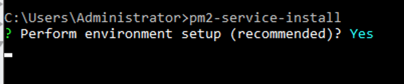

Ah, legacy servers. Gotta love em, right? But just because we have some constraints to work around doesn't necessarily mean we can't have nice things.

As my team transitions to writing more and more of our application as node.js powered microservices, we were starting to feel the pain of not having a good solution for starting things up automatically after an OS reboot. We actually did have a way to make it work, but it involved using the Windows Task Scheduler, and a batch file, and some tedious work any time there was a new node app to add to the mix. Trust me, the world is a better place if I don't share those detials.

Recently a coworker and I went back to the drawing board on this. It's been a few years since we came up with the solution-that-shall-not-be-named, and we figured there's a decent chance that someone figured out something better since then. We're using [PM2](https://pm2.io/runtime/) for the process management, and it has built in functionality for daemonizing and restarting your apps after a system reboot, but only for *nix systems. We've known this for a while.

I don't know when, but at some point their official docs added some links to two community projects **pm2-windows-startup** and [pm2-windows-service](https://www.npmjs.com/package/pm2-windows-service). I'm only linking the latter because that's the one we decided to go with.

The former, **pm2-windows-startup** is much simpler in design, with fewer dependencies; but it uses a more blunt approach to get the job done. It installs a registry entry that runs on startup and calls **wscript.exe** (a system app that can run vbscript scripts) and has it run an included vbscript script that then runs the `pm2 resurrect` command. This doesn't seem super frail to me (certainly a step or three up from our home-rolled solution with task scheduler!) but can we do better?

The latter, **pm2-windows-service** says in its readme that it was inspired by pm2-windows-startup; and it takes a different approach. It installs an actual Windows Service that will start automatically after a reboot, and which you can start/stop/restart from the Services panel. Essentially it accomplishes the same goal: running `pm2 resurrect` but it also gives you that start/stop/restart control in the same interface as all the rest of your system services. I'm happy to report that this solution is working well for us!

Sadly, it did not work perfectly out of the box, so here's how we were able to get it running:

First, you're going to need pm2, pm2-windows-service, and npm-check-updates (more on that last one in a moment).

```
npm i -g pm2 pm2-windows-service npm-check-updates
```

In theory, your next step would be to run the following:

```
pm2-windows-service
```

...and answer the questions that it asks. Here's what we did:

```
Perform environment setup (recommended)? Yes

Set PM2_HOME? Yes

PM2_HOME value (this path should be accessible to the service user and
should not contain any "user-context" variables [e.g. %APPDATA%]): d:\web

Set PM2_SERVICE_SCRIPTS (the list of start-up scripts for pm2)? Yes

Set the list of start scripts/files (semi-colon separated json config
files or js files) (I left this one blank)

Set PM2_SERVICE_PM2_DIR (the location of the global pm2 to use with the service)? [recommended] Yes

Specify the directory containing the pm2 version to be used by the
service C:\USERS\ADMINISTRATOR\APPDATA\ROAMING\NPM\node_modules\pm2\index.js

PM2 service installed and started.
```

If that works for you, congratulations, you're basically done! However, it seems that for some more recent versions of node and/or windows, there's a dependency that needs to be updated semi-manually. Here's what to do if you try to run `pm2-service-install` and it gets hung up after you answer the first question, like this:



Fortunately, [other people had already run into this problem and found a solution](https://github.com/jon-hall/pm2-windows-service/issues/51#issuecomment-444160883)... Run these steps:

```
cd %AppData%\npm\node_modules\pm2-windows-service
ncu inquirer -u
npm i
```

Here, we're changing into the installation folder for `pm2-windows-service` and using `npm-check-updates` (the command for which is `ncu`) to update package.json with a newer version of the `inquirer` module. Ours updated from **1.1.2** to **6.3.1**. Then we run npm install to install the updated dependencies. After that, `pm2-service-install` can run successfully.

Then, how does it work?

`pm2-service-install` creates a windows service that you can control from the services panel. When you start the service, it will use a file located at `%PM2_HOME%\dump.pm2` to resurrect your running services.

So now all that's left to do is to start each of your apps using pm2 and get everything configured how you'd like, and to run `pm2 save` to write the state of things into `%PM2_HOME%\dump.pm2`.

Now, after a system reboot, your node apps will come back online automatically. Just remember to run `pm2 save` after any change you make to your pm2 state that you want to persist.
