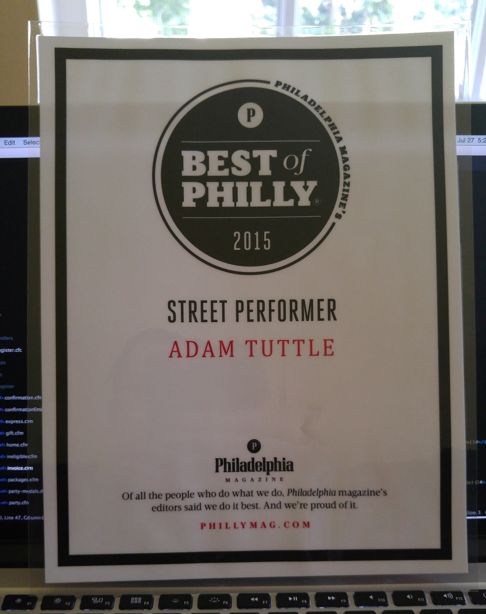

> This isn't going to be an update to [my ongoing hackintosh project](/blog/2019/building-a-hackintosh-2019/). I'm away on a camping trip this weekend and the hackintosh is kind of stalled at the moment. I have many irons in the fire and haven't been able to give it any attention in a few days. I'll get back to it when I have more details to share, but don't worry, I am still working on it! But I want to keep the momentum going so I'm going to tell a fun story instead.

I live near Philadelphia, and I worked in the city for a previous job. When you go places around the city, especially restaurants, you'll often notice small signs proclaiming the establishment was voted "Philly's Best Pork Roll" or "Philly's Best Coffee" or "Philly's Best Halal Food Truck." I guess these are awarded based on community polling done by one of the local magazines, [PhillyMag](https://www.phillymag.com/).

Imagine my surprise when I got an email one day letting me know that I had won an award from them, and that they wanted my address to send it to me. I had no idea what it was for (the email didn't say), and I figured it was probably a mistake, but (1) I was in a small amount of shock, and (2) who am I to look a major award in the mouth?!

<iframe src="https://giphy.com/embed/3ohs7Mx78Zt2x2xgbu" width="480" height="270" frameBorder="0" class="giphy-embed" allowFullScreen></iframe>

So I replied to their email with my address and a note that said I thought they might have found the email address of the wrong Adam Tuttle in Philadelphia. I explained that if they would only let me know what this was all about, I would be happy to set the record straight. I never heard back.

Then one day, this showed up in the mail.

I don't know who this street performing namesake is, but I am at once grateful for [the good fortune he brings to our shared name](https://www.phillymag.com/best-of-philly/adam-tuttle/), and sad that he might not have ever received his award. I like to imagine that he's still out there drumming on buckets, dreaming of the day he'll be voted Philly's Best. In the meantime, I display this sign proudly in my office.
