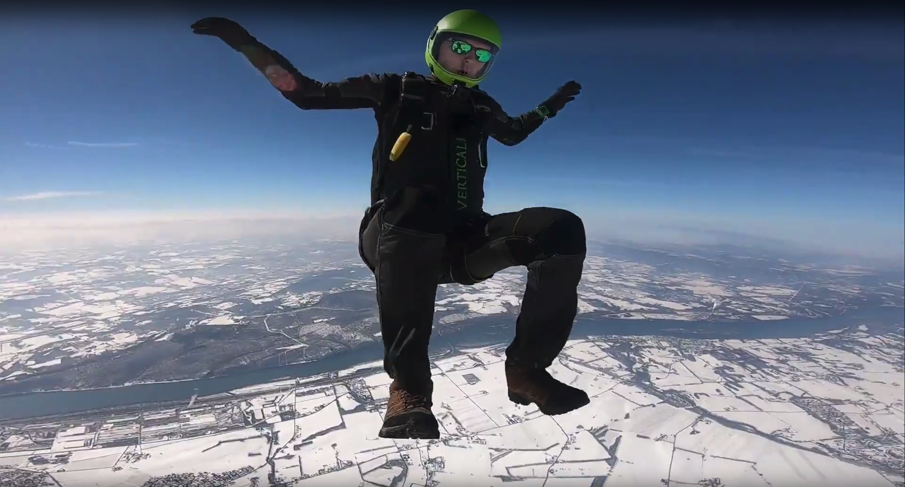

import YT from '../../../components/FluidYouTube';

In skydiving we have a saying: Slow is smooth, and smooth is fast.

When you get out of an airplane at 14,000 feet in the air, you have somewhere between 40 and 60 seconds to play before you need to do the important work of saving your life by opening your parachute. (The timing depends on what exactly you're doing while you fall.)

Once you get beyond the concept that it's possible to get out of an airplane in flight and then touch down softly, you start to want to hang out with friends while you're there.

This has actually turned into a sport with a lot of different disciplines within it. For example, here's the 2019 performance of this year's national champion team, Rythm:

<YT id="etTZSNgIm-A" />

Like most other sports, the goal here is to get the most "points." In formation skydiving a point is a completed formation, possibly following a compulsory movement. Basically, turn a certain way and be holding onto each other in the right spots.

As you can imagine, it's easy to feel pressured to move quickly. You have limited time and the goal is to get as many points as you can, and hope you get more than the other teams. But somewhat counterintuitively, most professional coaches will teach their teams to slow down and be deliberate about their movements. They say, "Slow is smooth, and smooth is fast."

The meaning is that when you're taking enough time to be deliberate and calculated in your movements, you're less likely to make mistakes. And the fewer mistakes you make, the faster you can go. If you instead act frantically, you're more likely to make mistakes and those mistakes are more likely to cost you both in the moment and again later.

In skydiving, that might mean you miss your grip now and you also put yourself in a harder to reach spot in the sky for a future formation, slowing the team down even more.

---

I was reminded of this saying yesterday when, in an attempt to multitask and move (with the clear eyes of hindsight) what was admittedly a little bit frantically, I accidentally deleted the most important partitions on my computer: The operating system I use every day at work.

You may know that [I use a Hackintosh that I built for myself this year](/blog/2019/building-a-hackintosh-2019/). I built it on some pretty great hardware, and I'm attempting to set it up to dual-boot Windows for more options in PC gaming. Thinking I was _sooo clever_ I setup the installer to run while I would be showering. Multitasking for the win! Except, after my shower as I was brushing my teeth, I realized what I had done. (Basically: I forgot to unplug the OSX drive and plug in the empty drive for Windows to install onto.)

This story is not a complete tragedy, because thankfully I had a recent complete drive clone available to recover with, but man did it feel like a gut-punch at the time! Trying to rush really bit me, and if I wasn't prepared that could have ruined a lot more than my day.

---

The same principle is true for engineering work. Taking the time to be deliberate, you'll make fewer mistakes and have cleaner solutions. It might mean you'll have more, better, (any?) automated tests, which not only give you confidence in what you're bulding now, but also provide confidence that you haven't inadvertently broken it later.

Too often in the software world we're focused on the deadline, and then what happens? I bet you can relate to this: You put in extra hours and stress yourself out, but you meet that deadline. Then the customer ends up not touching your work for months. How infuriating!

I'm not here to tell you how to estimate projects and how to account for the time to write tests and documentation (if you've got that magic mirror, do share!) but what I am saying is that you can probably afford to take the time to be deliberate. If you do, it will save you time in the long run.
