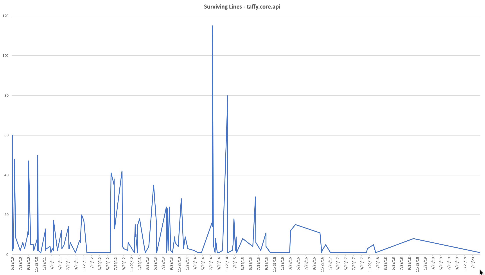
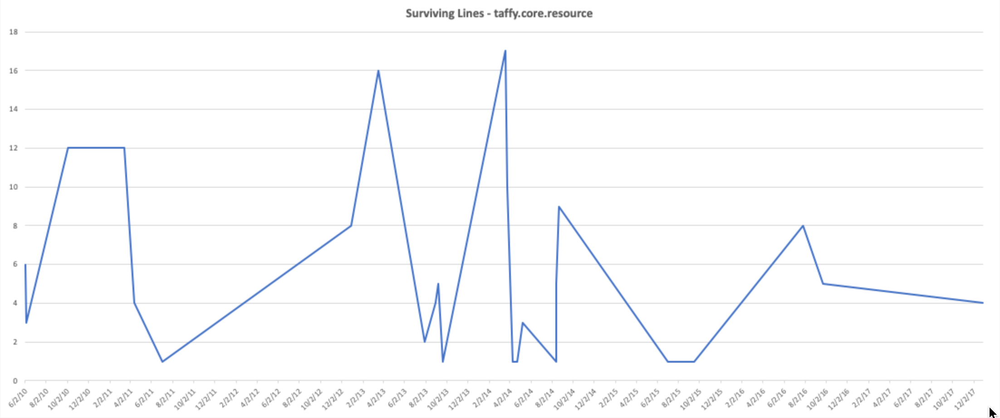
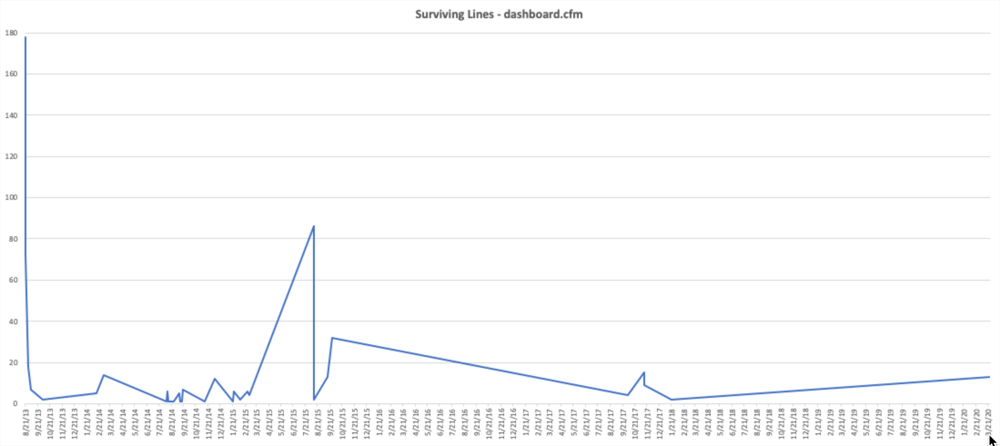

As programmers we often look at code we wrote even as recently a few months ago in disgust. Sometimes we just have to do something distasteful to get things done on time or on budget; or sometimes we've learned a lot since the code was written; and sometimes we can't event explain it.

Taffy is TEN years old today 🍰🥳 (Technically, yesterday, but it was the weekend and who's counting?) and it still ranks as one of the pieces of software that I am most proud of in my career. I created it because I was fascinated by doing REST well in CFML, and not particularly thrilled with any of the options that were available at the time. None of them were _bad_, but I had learned some things in recent years and saw that there was potential to build something better. So I did.

It now represents a ton of personal growth and success for me, successful collaboration with the community at large, and many opportunities to continue branching out into other related interests. I got to speak at several conferences, and [I wrote a book about REST](https://restassuredbook.com), and that wouldn't have happened without the success of Taffy.

# Happy Birthday Taffy!

To celebrate Taffy's 10 year birthday, I finally got around to restoring the database backup from my last website so that I can resurrect articles from it! I think I've found and restored every post about Taffy from the last 10 years, from [the original announcement in 2010](/blog/2010/Taffy-A-Restful-Framework-for-ColdFusion/) through [Taffy 3.1.0-RC1](http://iq.localhost.tools:8000/blog/2015/Taffy-3-1-0-RC1/) in 2015. I guess I never posted after the final 3.1.0 release. 🤷‍♂️

All of those old posts are now listed on [the full blog index](/blog), and now's a good time to look for them because the early years don't have much more than Taffy content at the moment. I'll get around to restoring the other old posts too, but with limited time and the birthday and all, it seemed like a good way to narrow the scope for phase 1 of the restoration project. (I started blogging in 2007 and wrote 48 entries that year! 😬)

Also... This doesn't really have any useful meaning (I think?) but I thought it might be fun to go back and look at just how much of that old code is still hanging around. How many lines of 10 year old code are there still being used today in Taffy? I'll drop a note about the methodology for getting these numbers at the bottom of this article. For now, let's just enjoy some numbers.

## taffy.core.api



Aside from a few spikes here and there, the line count is pretty evenely distributed from early on in the repo through approximately August of 2015. It tapers off a bit after that because we've been pretty stable ever since. The 3.1 release came after, but includes a lot of the later changes in that time range (3.0 was released in November of 2014).

To reiterate, this is not a count of new lines over time, this is a count of the number of lines that were written on the given date that remain unmodified in the project today. That it is so front-loaded is also something I take pride in: We got it "right" early on.

## taffy.core.resource



There are far fewer lines of code in taffy.core.resource, so I'm not surprised that the counts aren't as high; but again it looks like the story is mostly the same. Early efforts were pretty solid and some additions throughout 2013 have proven useful enough to stand the test of time.

## dashboard.cfm



The dashboard got [a ground-up rewrite in 2013](https://github.com/atuttle/Taffy/commit/4811a932086a03100d045eb111ae7744b25ad220#diff-54694bb9609e53b9bc660d0d7f14b3ae) so its current iteration doesn't have anything older than that.

## Documentation

I'm super proud of everything about Taffy, and that extends equally to [our documentation](http://docs.taffy.io). It's not perfect (what docs are?), but we've tried really hard to make sure that everything is explained and that it's reasonably well organized. We even keep [documentation for older versions](http://docs.taffy.io/2.0.0) still available and usable! That's more than I can say for a lot of open source projects that just burn it all down and start over with new documentation when they start a new major version of the library.

Combined between all versions, we currently have more than 16,400 lines of markdown documentation. There is some repetition when things don't change between versions, but I still think this is a wonderful thing because it maintains what's relevant to any given user no matter what version of Taffy they're using.

## Contributors

None of this would have happened if people hadn't:

1. Seen value in the code I was sharing,
1. Tried it for themselves, and
1. Cared enough to file bug reports or feature requests, share it with their peers, and in some cases, even contribute code and documentation back to the project.

As of right now we've had 42 people contribute to the code repo, and 7 of them also contributed to the documentation. I am so grateful and humbled for all of your participation over the last DECADE!

Thank you!! 🥳 🤗 🍾

## Methodology, or, Where did these numbers come from?

While they aren't perfect, I was able to extract something close by using `git blame` to get the date that each line of each file was last modified. I combined this with some *nix CLI tools to get counts by date:

```bash
$ git blame dashboard.cfm | awk '{print $4}' | sort | uniq -c
```

I copied this data into a few Excel sheets and used Excel's charting features to generate the charts.

The documentation line count was generated using this command in the `src` folder of the Docs repo:

```bash
$ wc -l *.md | grep '\d\.\d\.\d\.md' | awk '{print $1}' | sum
```

The contributor counts are provided directly from GitHub.
