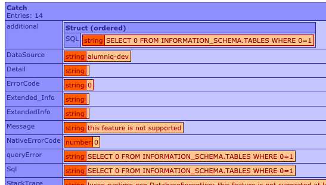

I've written previously about how my company is in the process of [migrating our main app from Adobe ColdFusion to Lucee](https://adamtuttle.codes/blog/2019/from-coldfusion-to-lucee/). This post is an update, several months into that process.

Not unlike that first post, our biggest problem area in the migration since then has been ORM. Since then we've accomplished the primary goal of _the application starts and you can do some basic browsing_, and we're now deep into the process of _test every aspect of every feature, making sure they still work as expected_, which is... tedious.

The most recent problem we've been running into is that Lucee completely chokes if you've got a transaction that contains both an ORM read/write and a simple SQL query. There are different failure modes, but the worst is when the ORM usage comes first:

```
transaction {
	var x = entityLoadByPk("Foo", 1);
	x.setBar("foo bar");
	entitySave(x);

	queryExecute("select 1");
}
```



The error message thrown is, "this feature is not supported". (Firstly... thanks for the great error message! 👍)

You can ignore the fact that the SQL statement in the screen shot above is not `select 1`, matching my code snippet above. It doesn't matter for our purposes here. Any query will do.

We are, of course, [not the first team to run into this issue](https://luceeserver.atlassian.net/browse/LDEV-1564). In that Lucee bug report, others who found this before us suggested prepending the contents of any affected transaction with a simple query like the one seen in the above screen shot. We soon realized that the even-simpler `select 1;` was equally effective.

However, this alone doesn't make everything work. With the above code block updated like the following, Lucee no longer throws an exception, yay!

```
transaction {
	queryExecute("select 1");

	var x = entityLoadByPk("Foo", 1);
	x.setBar("foo bar");
	entitySave(x);

	queryExecute("select 1");
}
```

It's great that no exception is thrown, but sadly it has stopped persisting the included ORM mutation at all, and is performing this failure **silently**. ORM reads seem to work fine as long as an SQL query is run first, but no mutations are persisted. _Not cool!_

Even though Lucee have been silent on the bug report since May of 2018, others in the community have been helping each other out in the comments. One suggestion was that you could add a manual `ORMFlush()` after your transaction to get Lucee to do what it should have already done, and commit your ORM mutations. That did seem to work, but it made me curious about other potential problems; so I threw together a quick repro case to isolate the issue and allow me to test different theories.

```
component {

	function afterQuery(rc){
		transaction {
			queryExecute("select 1");

			var o = entityLoadByPK("Pledge", 6000);
			var existing = o.getHome_PostalCode() ?: 0;
			o.setHome_PostalCode( existing+1 );
			entitySave(o);
		}

		var t = queryExecute("select home_postalCode as x from GiftPledge where pledgeId = 6000").x;
		writeDump({ before: existing, expected: existing+1, actual: t, pass: t == existing+1 });
		abort;
	}

	function afterQueryWithFlush(rc){
		transaction {
			queryExecute("select 1");

			var o = entityLoadByPK("Pledge", 6000);
			var existing = o.getHome_PostalCode() ?: 0;
			o.setHome_PostalCode( existing+1 );
			entitySave(o);
		}

		ormFlush();

		var t = queryExecute("select home_postalCode as x from GiftPledge where pledgeId = 6000").x;
		writeDump({ before: existing, expected: existing+1, actual: t, pass: t == existing+1 });
		abort;
	}

}
```

Here, I'm grabbing a random row of test data from our database via ORM, incrementing its postal code column as if it were some sort of counter (it's just test data and I just needed to see if mutations were persisted), and saving it. The `afterQuery` function doesn't have an `ORMFlush()` and the dump shows that the test fails: ORM thinks it's making the change (no exception), but it doesn't get persisted to the database.

The `afterQueryWithFlush` function is the same thing, but adds an `ORMFlush()` after the transaction ended. In this version, the mutation is persisted. So while that's less than ideal, at least we have a simple work-around.

An alternative work-around worth mentioning is to split ORM actions and SQL actions into separate transactions, if you can. If you can't, `ORMFlush()` is the only option we've found.

But this made me ask myself: If the ORM Session is getting flushed, does Lucee open a new session for the rest of the request to use? So I added another test:

```
function doubleWithFlush(rc){
	transaction {
		queryExecute("select 1");

		var o = entityLoadByPK("Pledge", 6000);
		var existing = o.getHome_PostalCode() ?: 0;
		o.setHome_PostalCode( existing+1 );
		entitySave(o);
	}
	ormFlush();

	var t = queryExecute("select home_postalCode as x from GiftPledge where pledgeId = 6000").x;
	writeDump({ before: existing, expected: existing+1, actual: t, pass: t == existing+1 });

	transaction {
		queryExecute("select 1");

		var o2 = entityLoadByPK("Pledge", 6000);
		var existing2 = o2.getHome_PostalCode() ?: 0;
		o2.setHome_PostalCode( existing2+1 );
		entitySave(o2);
	}
	ormFlush();

	var t2 = queryExecute("select home_postalCode as x from GiftPledge where pledgeId = 6000").x;
	writeDump({ before: existing2, expected: existing2+1, actual: t2, pass: t2 == existing2+1 });
	abort;
}
```

This is basically the same test as above, except that I'm repeating the mutation step a second time, after an `ORMFlush()`. Fortunately, this test passes just fine. That's a relief!

I haven't thought of any other problems the necessity of ORMFlush might cause us, but if any come up I'll be sure to write about them here.
