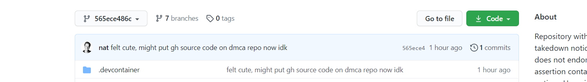

Until today I was complacent about signing my git commits. Who cares if they're signed?

Well, it matters.

Git will allow you to associate any name and email address with a commit, without any oversight to ensure you have that name and control that email address. And that's fine, because git is not an email platform. Where this becomes problematic is spoofing -- and that's the part I didn't get until today. I can create commits and attribute them to Bill Gates or Steve Ballmer or _you_ if I know your name and email address. And whose email address is truly private any more?

Recently, via DMCA takedown request, the popular `youtube-dl` client for downloading youtube videos was at least temporarily removed from GitHub. What's interesting about this is what happened next. GitHub uses [a repo named DMCA](https://github.com/github/dmca) to manage DMCA requests and notify its users when they're affected. In retalliation for the RIAA causing a beloved archival tool, someone made a pull request to the DMCA repo to add the full `youtube-dl` source to it. Of course it won't be accepted, but if you have [the right link](https://github.com/github/dmca/tree/416da574ec0df3388f652e44f7fe71b1e3a4701f) then it looks like it was merged and the repo contents were replaced, unless you notice the URL.

Kind of a big middle finger to the whole thing. It's kind of immature, but whatever. I get it. I laughed it off and went about my business.

Then today I saw that there was supposedly some sort of ["leak" of the GitHub source code](https://www.reddit.com/r/programming/comments/joa39m/github_source_code_leaked_online/) by a similar means. It was [apparently](https://www.reddit.com/r/DataHoarder/comments/jnzxmd/someone_pushed_github_source_code_to_their_dmca/gb5unub/) available on archive.org's wayback machine for a while, but it's been removed from there and also from the similar link that would show the code (as the `youtube-dl` link still does)...

This screen shot of the commit proposed for merge into DMCA is what opened my eyes:



Without a signature, there's no way to know if this was really committed by Nat Friedman. Of course it wasn't, but there's no good way to prove it. Git has a way to let you provide that proof: Signing your commits. The signature verifies that it was you, the owner of the key, that made the commit.

### How to sign your commits

There are plenty of guides out there, including [the one I used][guide] provided by GitHub, so I'm goign to make this short and sweet. If this isn't enough for you, or if you're not on a Mac, I suggest you start by looking at [the GitHub guide][guide].

Do you have `gpg` installed?

```bash
$ which gpg
```

If not, install it:

```bash
$ brew install gpg
```

Check to make sure you don't already have a key:

```
$ gpg --list-secret-keys --keyid-format LONG
```

If you need to generate a key:

```bash
gpg --full-generate-key
```

You'll be prompted for a key type. I went with an RSA key.

For size, choose at least 4096.

Specify a length of time for the key to be valid.

When prompted for your email address, be sure to use one that's associated with your GitHub profile and verified with GitHub.

After your key is created, you'll need to get its ID for the next step. In this example, the ID value you need to get is `3AA5C34371567BD2`

```
$ gpg --list-secret-keys --keyid-format LONG
/Users/hubot/.gnupg/secring.gpg
------------------------------------
sec   4096R/3AA5C34371567BD2 2016-03-10 [expires: 2017-03-10]
uid                          Hubot
ssb   4096R/42B317FD4BA89E7A 2016-03-10
```

Display the ascii-armor formatted version of your new key:

```bash
$ gpg --armor --export 3AA5C34371567BD2
```

Copy the output, beginning with `-----BEGIN PGP PUBLIC KEY BLOCK-----` and ending with<br/> `-----END PGP PUBLIC KEY BLOCK-----`. Include those markers in what you copy.

In your GitHub profile, go to Settings > SSH and GPG Keys. Click the "New GPG key" button. Paste in the content you just copied, and save it. GitHub will now recognize any commits signed with that key as having been signed by you.

Next, we need to tell git to sign all of your commits. I don't see any reason why you wouldn't want to sign all of your commits to every repo going forward, so here's how you set the setting globablly. Note that we're again referencing the GPG key ID value you copied above:

```bash
$ git config --global user.signingkey 3AA5C34371567BD2
```

This works and if you don't mind typing in your password every time you commit something, you're done. My computer is well-protected enough that I want my password to be remembered for commits. For this situation, GitHub recommends installing [GPG Suite](https://gpgtools.org/) which allows you to save the gpg key password into your keychain, which if I understand correctly, means that you'll only need to enter your keychain password (system login password) after a long period of inactivity/etc; and that for multiple commits a few minutes apart signing will just happen invisibly.


[guide]: https://docs.github.com/en/free-pro-team@latest/github/authenticating-to-github/managing-commit-signature-verification
