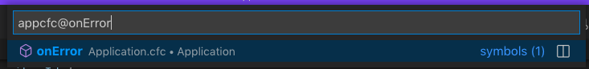
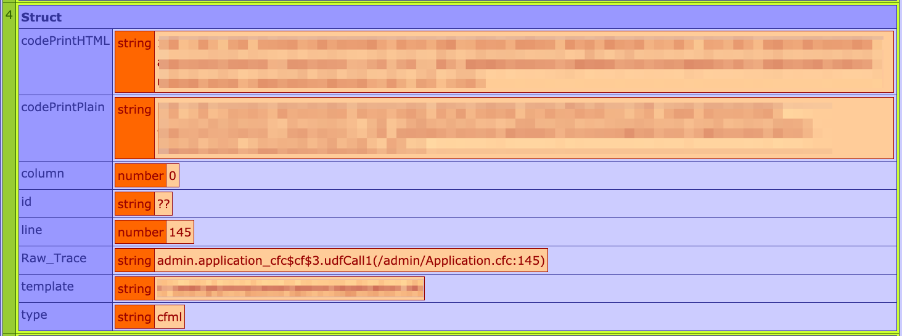

I wrote a helpful and tiny automation that I want to share with you. If you use the [Lucee](https://www.lucee.org/) CFML application server, and a code editor that supports the same advanced "go to file" syntax as [VSCode](https://code.visualstudio.com/), it might make your life a little bit easier.

The Lucee part is kind of obvious; either you're using it or you're not.

The VSCode-style "go to file syntax" is less obvious. Specifically, what I'm referring to is the go-to-file command (cmd-p on Mac, ctrl-p on Windows) where you can do a fuzzy search of the file name, and then once you've located the right file, you can append either `@symbol` or `:line-number` to the file name to jump directly to that symbol (e.g. function name, variable, etc) or line number in the file. Credit where it's due, the first time I remember seeing this done was in Sublime Text.



Do you see where this is going yet?



We have an editor capable of doing advanced searches for path and file name and taking you directly to a specific line number; and we have an error stack trace that includes the file path and line number in almost exactly the format we would use to load it in the editor...

For I-don't-even-want-to-imagine-how-many-years-of-my-life, now (ugh!) I've been getting that file name via copy and paste like a chump, or worse, typing it manually, with my hands, like a savage.

I would rather click on the file name in the stack trace and have it open directly to that location in VSCode. If I could do that, that would be swell. I might even work on that. But for now, here's what I've already done, because it was _easy_:

Add this to a page that includes a Lucee stack trace dump, and clicking on the box with the file path will copy it to your clipboard. I added it to my team's error page that we see in local development and QA environments when there's an error.

```html
<style type="text/css">
	.luceeN1 { cursor: pointer; }
</style>
<script type="text/javascript">
	$(document).on('click', '.luceeN1', (e) => {
		try {
			const initialText = $(e.target).html();
			const path = initialText.split('(')[1].split(')')[0];
			if (path[0] === '/'){
				//everything after the first character
				navigator.clipboard.writeText( path.slice(1) );
			}else{
				//the whole thing
				navigator.clipboard.writeText( path );
			}
		}catch{
			navigator.clipboard.writeText( $(e.target).html() );
		}
	});
</script>
```

It's kind of naïve in its implementation, granted. You have to be using a modern enough browser for [navigator.clipboard support](https://caniuse.com/?search=navigator.clipboard), and it applies all of this logic to every light-orange box when really it only does anything useful for the few of them that we're narrowly concerned with... But it works!

It assumes that jQuery is available on the page. In my case, it always will be, so why not use it? Then, on click, it grabs the contents of the first thing it can find between parenthesis. Actually, if there is a second open-parenthesis `(` before the first close-parenthesis `)` then it will grab just what's between those first two open-parenthesis. Like I said... it's naïve!

Whatever it finds, it copies that to your clipboard, making it easy to paste into VSCode and open exactly that file to exactly the line in question.

One other little thing. In my screen shot you can see that the file path begins with a slash: `/admin/Application.cfc:145`. If that admin folder is in the root of your project, VSCode won't find the file because of the slash, and it hurts nothing to remove the leading slash, so I do. If you're on Windows I imagine the paths will be different and you may need to reverse the slashes, and some other things, but hopefully this can get you started.
